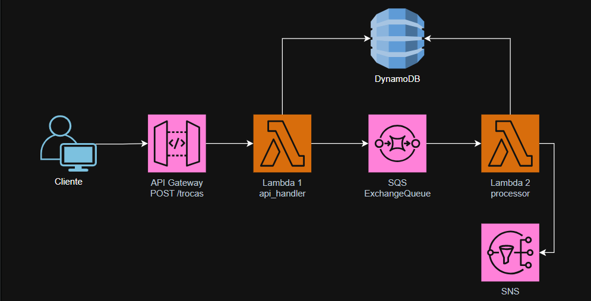

# 📱 Sistema de Troca de Celulares – AWS Serverless

Este projeto implementa uma API serverless para gerenciar pedidos de troca de celulares, utilizando serviços AWS como Lambda, API Gateway, DynamoDB, SQS e SNS.

## 🚀 Arquitetura da Solução

A arquitetura é totalmente serverless e permite processamento assíncrono das requisições.

### 🔧 Fluxo do Sistema

1. Cliente envia uma requisição `POST /trocas` para a API
2. A Lambda Handler processa o pedido e envia para a fila SQS
3. A Lambda Processor consome as mensagens da fila e:
   - Salva os dados no DynamoDB
   - Publica uma notificação no SNS

### 🧠 Diagrama da Arquitetura



> Certifique-se de colocar a imagem dentro da pasta `doc` com o mesmo nome ✨

---

## 📂 Estrutura do Projeto

```bash
/troca-celular-app
 ├── src
 │   ├── api_handler
 │   │   └── app.py
 │   └── processor
 │       └── app.py
 ├── template.yaml
 └── README.md
